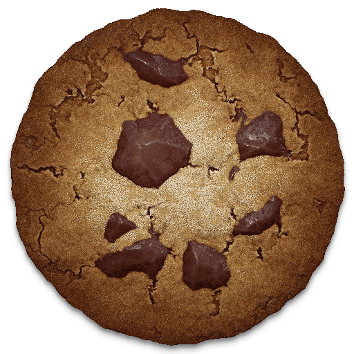
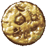

<div align="center">



# Cookie Bridge

**A complete REST API & live dashboard for Cookie Clicker**

[](https://store.steampowered.com/app/1454400/Cookie_Clicker/)
[](http://localhost:8000)
[](http://localhost:8000/docs)
[]()

> Monitor every stat, trigger every action, and chart your entire cookie empire — all over HTTP from any tool, script, or AI agent.

</div>

---

## What is Cookie Clicker?


**Cookie Clicker** is an incremental idle game where you bake cookies — starting from one click at a time, building up to trillions of cookies per second through buildings, upgrades, prestige ascensions, and minigames.

The Steam version runs on **Electron** (Node.js + Chromium), which means the game's server layer is a plain JavaScript file (`resources/app/start.js`) that we can patch directly.

**Cookie Bridge** replaces that file with an extended version that adds a full HTTP API alongside the game — zero performance impact, no DLL injection, no external processes.

<br clear="right"/>

---

## What Cookie Bridge adds

### 🖥️ Live Game View
An always-on floating panel inside the game showing real-time stats.

| Live View panel | Minigame detail |
|---|---|
| Cookies · CpS · CpC · Prestige · Ascension | Grimoire spells, Pantheon slots, Garden grid, Stock Market, Legacy |
| Buff alerts · Golden Cookie shimmer · Wrinkler count | Mana bar, swap count, plant grid, stock positions |

> The panel updates every 500 ms for fast data (cookies, buffs, shimmers) and every 5 s for slow data (buildings, minigames, upgrades).

---

### 📡 REST API — 52+ Endpoints

Every piece of game state is readable. Every action is writable.

```
GET  http://localhost:8000/state          → full snapshot of everything
GET  http://localhost:8000/stats          → annotated stats with Game.* source
GET  http://localhost:8000/docs           → interactive API reference
```

**Buy a building:**
```bash
curl -X POST http://localhost:8000/action/buy/build/Grandma/10
# → {"ok":true,"message":"10x 'Grandma' enfileirado.","preco_total":...}
```

**Cast a Grimoire spell:**
```bash
curl -X POST http://localhost:8000/action/enqueue \
  -H "Content-Type: application/json" \
  -d '{"type":"cast_spell","spell_name":"Hand of Fate"}'
```

**Check current buffs:**
```bash
curl http://localhost:8000/effects/view
# → {"tem_buffs":true,"buffs":{"Frenzy":{"timeLeft":77,"mult":7},...}}
```

---

### 📈 Evolution Charts `/charts`

Historical data from the auto-save database visualized as interactive charts.

- **Combined view** — all 6 metrics as colored lines on one chart
  - Toggle each metric on/off with colored pills
  - **% Growth from baseline** or **Log scale** mode
  - **Relative** (minutes since run start) or **Absolute** time axis
- **Individual cards** — one chart per metric with current value + last-interval delta
- Metrics tracked: CpS · CpC · Cookies in bank · Buildings · Upgrades · Legacy Gain

---

### 💾 Auto-save Database

Every 5 minutes the bridge saves a full snapshot to:
```
%USERPROFILE%\CookieBridge\saves.ndjson
```

Each line contains:
```jsonc
{
  "ts": "2026-05-24T22:00:00Z",
  "bakery": "akirabu",
  "run": 25,               // ascension number
  "prestige": 178241840626128,
  "cps": 2.39e+48,
  "cookies": 7.44e+49,
  "total_buildings": 12289,
  "upgrades_bought": 692,
  "legacy_gain": 2726,     // prestige levels gained if ascending now
  "save": "Mi4wNTN8fC4u..."  // full base64 Export Save string
}
```

> The `save` field is identical to Cookie Clicker's own **Export Save** — paste it into Import Save to restore at any point.

---

### 📚 Interactive Docs `/docs`

Auto-generated API reference with every route, method, parameter, and example — always in sync with the running server.

---

## Full endpoint reference

<details>
<summary><b>State & Stats</b></summary>

| Method | Path | Description |
|--------|------|-------------|
| GET | `/` | Health check, server status |
| GET | `/state` | Complete game state (buildings, upgrades, minigames, buffs…) |
| GET | `/stats` | All numeric stats with `Game.*` source annotations |
| GET | `/upgrades` | Upgrades currently in the shop |

</details>

<details>
<summary><b>Actions</b></summary>

| Method | Path | Description |
|--------|------|-------------|
| POST | `/action/enqueue` | Queue any action by type |
| GET | `/action/queue` | View pending action queue |
| DELETE | `/action/queue` | Clear queue |
| POST | `/action/buy/build/{name}/{qty}` | Buy 1 / 10 / 100 buildings |
| POST | `/action/sell/build/{name}/{qty}` | Sell buildings |
| POST | `/action/buy/upgrade/{name}` | Buy an upgrade from the shop |
| GET | `/action/view/{name}` | Inspect a building or upgrade |
| GET | `/action/view/lvl/{name}` | Sugar Lump upgrade info for a building |

</details>

<details>
<summary><b>Minigames</b></summary>

| Method | Path | Description |
|--------|------|-------------|
| GET | `/golden_cookie/view` | Active shimmers on screen |
| GET | `/effects/view` | Active buffs and timers |
| GET | `/sugarlump/view` | Sugar lump status |
| POST | `/sugarlump/set/{building}` | Spend a lump on a building level |
| GET | `/prestige/view` | Prestige / heavenly chips / ascension info |

</details>

<details>
<summary><b>Database & History</b></summary>

| Method | Path | Description |
|--------|------|-------------|
| GET | `/db/info` | DB file path, entry count, size, date range |
| GET | `/db/history?n=500` | Last N save entries (without the save string) |
| GET | `/db/save/latest` | Latest entry with full base64 save string |
| POST | `/db/save/now` | Trigger an immediate DB snapshot |
| GET | `/history/states` | Last 60 in-memory state snapshots |
| GET | `/history/actions` | Last 200 in-memory action records |
| GET | `/io` | Node.js memory + OS stats |

</details>

<details>
<summary><b>Pages</b></summary>

| Method | Path | Description |
|--------|------|-------------|
| GET | `/docs` | Interactive API reference |
| GET | `/charts` | Evolution charts dashboard |
| GET | `/visual` | Visual game state page |

</details>

---

## Setup

### Requirements

- **Cookie Clicker** v2.053 on Steam (Windows)
- **Windows 10/11** with PowerShell
- Run install script as **Administrator** (writes to `Program Files`)

---

### Step 1 — Download

```powershell
git clone https://github.com/ToDyNh0/cookie-clicker-API-mod.git
cd cookie-clicker-API-mod
```

Or download the ZIP from GitHub → **Code → Download ZIP** → extract.

---

### Step 2 — Install

Right-click `install.ps1` → **Run with PowerShell**  
*(or open an admin PowerShell terminal and run `.\install.ps1`)*

The script will:

1. Detect your Cookie Clicker installation automatically
2. **Backup** the original `start.js` as `start.js.original` (safe to restore)
3. Copy the patched `start.js` to `resources/app/`
4. Create the `mods/local/mod_api/` folder and copy the mod files

```
[backup] start.js.original saved
[OK] start.js installed
[OK] mod_api installed to C:\...\mods\local\mod_api
Installation complete!
```

---

### Step 3 — Enable the mod in Cookie Clicker

1. Launch **Cookie Clicker** on Steam
2. In the game menu, go to **Options → Mods**
3. Find **Cookie Bridge** in the mod list and enable it
4. Click **Restart with mods**

 The golden cookie spinning in the corner means the mod is active.

---

### Step 4 — Open the API

With the game running, open your browser:

```
http://localhost:8000/docs      ← API reference
http://localhost:8000/charts    ← evolution charts
http://localhost:8000/state     ← raw JSON state
```

---

### Uninstall

```powershell
.\uninstall.ps1
```

Restores `start.js.original` and removes the mod folder. No trace left.

---

## How it works

```
┌─────────────────────────────────────────────────────────┐
│  Cookie Clicker (Electron / Chromium)                   │
│                                                         │
│  ┌──────────────────┐    state every 500ms / 5s        │
│  │  mod_api/main.js │ ─────────────────────────────►  │
│  │  (renderer)      │                                  │
│  └──────────────────┘     ◄── actions queue            │
│                                                         │
│  ┌──────────────────────────────────────────────┐      │
│  │  start.js  (Node.js main process)            │      │
│  │                                              │      │
│  │  HTTP server on port 8000                    │      │
│  │  ├── GET /state  → JSON                      │      │
│  │  ├── POST /action/enqueue → queue            │      │
│  │  ├── GET /docs   → HTML                      │      │
│  │  └── GET /charts → HTML + Chart.js           │      │
│  │                                              │      │
│  │  Auto-save every 5 min                       │      │
│  │  → %USERPROFILE%\CookieBridge\saves.ndjson   │      │
│  └──────────────────────────────────────────────┘      │
└─────────────────────────────────────────────────────────┘
         │
         ▼  localhost:8000
┌─────────────────┐
│  Your tool /    │
│  AI agent /     │
│  Browser        │
└─────────────────┘
```

**Two-component design:**

| Component | Location | Role |
|-----------|----------|------|
| `start.js` | `resources/app/` | Node.js HTTP server in Electron's main process. Has full filesystem access, runs the API, saves the DB. |
| `mod_api/main.js` | `mods/local/mod_api/` | Runs inside the game's browser context. Reads `Game.*` variables every 500 ms / 5 s, POSTs state to the server, polls the action queue and executes actions by calling `Game.*` functions. |

---

## Number formatting

All cookie values use Cookie Clicker's own naming convention:

```
1,234          →  1,234
1,234,567      →  1.234 million
7.44e+49       →  74.400 quindecillion
2.376e+48      →  2.376 quindecillion
```

Covers up to **vigintillion** (10⁶³).

---

## License

MIT — do whatever you want with it.  
Not affiliated with Orteil / Dashnet.
